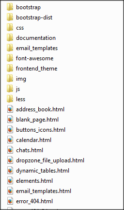

# Cloud Admin v1.1.1 Documentation #
Welcome to Cloud Admin - the responsive dashboard + frontend theme. This documentation will provide an in-depth explanation of tweaking this theme to suit your own needs. 

Please feel free to report errors, bugs, typos feature requests to be included in future versions.
# Support #

- Support via **email**: **fametaxi@gmail.com**
- Support via **Twitter**: [http://twitter.com/fametaxi](http://twitter.com/fametaxi)
- Subscribe to **RSS Feed** to get latest updates of the theme for free : [feeds.feedburner.com/CloudAdminTheme](feeds.feedburner.com/CloudAdminTheme)
- Support **Forum**: *Coming Soon (will notify via Twitter/Email/RSS)*

Follow us on Twitter to stay informed on latest updates. Register yourself on the support forum for the quicker response to queries & access to latest release of Cloud Admin.

# Changelog #
### v1.1.3 ###
- NEW - Added Markdown Editor
- UPGRADE - Admin upgraded to Bootstrap 3.0.3
- UPGRADE - Frontend upgraded to Bootstrap 3.0.3
- FIXED - Nested Tab color issue
- FIXED - Mini Sidebar persists across pages
- FIXED - Learn More button on Frontend fixed
### v1.1.2 ###
- Ajax powered Inbox
- Printer friendly Invoice (Try printing the Invoice page)
- Upgraded to Easy-Pie-Chart 2.1.1
- CKEditor bug fixed
- Easy-Pie-Chart IE9 bug fixed
- Miscelleneous bug fixes

### v1.1.1 ###
- Upgraded to Bootstrap 3.0.2
- Upgraded to Font Awesome 4.0.3
- Fixed plugin links in documentation

### v1.1 ###
- Responsive Vertical Timeline
- 'Chrome' styled tabs on box header
- Fixed issues with sidebar toggle
- Improved User Profile
- Added new animated sliders

# File and Folder structure #
The files are arranged in the following generic structure. Please note that details regarding the contents of each folder is discussed under respective topics.

- ***bootstrap*** - contains Bootstrap 3 source files
- ***bootstrap-dist*** - contains Bootstrap 3 distribution files (Production ready)
- ***css*** - contains the CSS files related to the theme
- ***documentation*** - contains the documentation
- ***email_templates*** - contains Mailchimp compatible email templates (can be found under "Email Templates" section in the dashboard)
- ***font-awesome*** - contains Font Awesome 4.0.1 files
- ***frontend_theme*** - contains the Cloud Frontend Theme and files (the folder structure of the one we're discussing)
- ***img*** - contains all images related to the theme (maintained under separate folders in a  section-wise fashion inside)
- ***js*** - contains all Javascript/jQuery related scripts. Also contains all jQuery plugins.
- ***less*** - contains all LESS files
- ****.html*** - all the HTML files 

# List of plugins #
The plugins used for this template are as follows. Also included are the links to their respective websites.

1. [Animate CSS](daneden.me/animate/‎)
2. [Autosize v1.17.8](http://www.jacklmoore.com/autosize "Autosize v1.17.8")
2. [Backstretch - v2.0.4](http://srobbin.com/jquery-plugins/backstretch/)
3. [Bootbox.js v4.0.0](http://bootboxjs.com)
4. [Bootstrap Date Range Picker v1.2](http://www.dangrossman.info/)
5. [Moment.js 2.1.0](http://momentjs.com)
6. [Bootstrap-fileupload.js j2](http://jasny.github.com/bootstrap/javascript.html#fileupload)
7. [Bootstrap-inputmask.js j2](http://twitter.github.com/bootstrap/javascript.html#tooltips)
8. [Bootstrap Hover Dropdown](http://cameronspear.com/blog/twitter-bootstrap-dropdown-on-hover-plugin/)
9. [BootstrapSwitch v1.8](http://www.larentis.eu/)
10. [Bootstrap Wizard Plugin](http://github.com/VinceG/twitter-bootstrap-wizard)
11. [Bootstrap WYSIWYG](http://github.com/mindmup/bootstrap-wysiwyg)
12. [jQuery Hotkeys](https://github.com/jeresig/jquery.hotkeys)
13. [CKEditor](http://ckeditor.com)
14. [Colorbox v1.4.31](http://www.jacklmoore.com/colorbox)
15. [Bootstrap Colorpicker](http://www.eyecon.ro/bootstrap-colorpicker)
16. [Date picker for pickadate.js v3.2.2](http://amsul.github.io/pickadate.js/date.htm)
17. [Time picker for pickadate.js v3.2.2](http://amsul.github.io/pickadate.js/time.htm)
18. [pickadate.js v3.2.2](http://amsul.github.io/pickadate.js)
16. [jQuery Simply Countable plugin](http://github.com/aaronrussell/jquery-simply-countable/)
17. [Blueimp Gallery](https://github.com/blueimp/Gallery)
18. [Blueimp Load-Image](https://github.com/blueimp/JavaScript-Load-Image)
19. [Blueimp Javascript-Templates](http://blueimp.github.io/JavaScript-Templates/)
20. [Blueimp Javascript Canvas-To-Blob](https://github.com/blueimp/JavaScript-Canvas-to-Blob)
17. [d3 charts](d3js.org/)
18. [Datatables](http://www.datatables.net)
22. [Dropzone Fileupload](www.dropzonejs.com/‎)
23. [EasyPieChart](http://robert-fleischmann.de)
24. [Flot Charts](www.flotcharts.org)
25. [Flot Growraf](thgreasi.github.io/growraf/growraf.html‎)
26. [Fuel UX Tree](https://github.com/ExactTarget/fuelux)
27. [FullCalendar v1.6.4](http://arshaw.com/fullcalendar/)
28. [GMaps.js v0.4.6](http://hpneo.github.com/gmaps/)
29. [Hubspot Messenger 1.3.6](https://github.com/HubSpot/messenger‎)
30. [Isotope v1.5.25](http://isotope.metafizzy.co)
31. [jqGrid  4.5.4 - jQuery Grid](www.trirand.com/‎)
32. [jQuery v2.0.3](jquery.org)
33. [jQuery blockUI plugin](http://malsup.com/jquery/block/)
34. [jQuery Easing v1.3](http://gsgd.co.uk/sandbox/jquery/easing/)
35. [jQuery Knob](https://github.com/aterrien/jQuery-Knob‎)
36. [jQuery Raty](https://github.com/wbotelhos/raty‎)
37. [jQuery Slimscroll v1.3.0](http://rocha.la/jQuery-slimScroll)
38. [jQuery Todo](https://github.com/paddyduke/jquery-todo)
39. [jQuery UI 1.10.3](http://jqueryui.com/)
40. [jQuery File Upload Plugin 5.32.6](https://github.com/blueimp/jQuery-File-Upload)
41. [jQuery Validation Plugin 1.11.1](http://bassistance.de/jquery-plugins/jquery-plugin-validation/)
42. [jQVMap Version 1.0](http://jqvmap.com)
43. [JustGage](http://www.justgage.com)
44. [Raphael 2.1.0](http://raphaeljs.com)
45. [LESS - Leaner CSS v1.4.1](http://lesscss.org)
46. [Magic Suggest](nicolasbize.github.io/magicsuggest/‎)
47. [Nestable jQuery Plugin]( http://dbushell.com/)
48. [Google Prettify](code.google.com/p/google-code-prettify/‎)
49. [Select2 3.4.4](ivaynberg.github.io/select2/)
50. [SliderNav](http://devgrow.com/slidernav)
51. [Sparklines (jquery.sparkline.js)](http://omnipotent.net/jquery.sparkline/)
52. [Tablecloth.js](https://github.com/bwsewell/tablecloth)
53. [Timeago](timeago.yarp.com/‎)
54. [TimelineJS - ver. 2.26.2](https://github.com/NUKnightLab/TimelineJS)
55. [Typeahead 0.9.3](https://github.com/twitter/typeahead)
56. [Uniform v2.1.0](http://pixelmatrixdesign.com)
57. [xCharts v0.3.0](http://github.com/tenXer/xcharts)
58. [jQuery Navmaster](http://github.com/davist11/jQuery-One-Page-Nav)
59. [jQuery ScrollTo](http://flesler.blogspot.com)
60. [jQuery Waypoint](https://github.com/imakewebthings/jquery-waypoints)
61. [jQuery Cookie](https://github.com/carhartl/jquery-cookie)
62. [Gritter Notifications](https://github.com/jboesch/Gritter)
63. [Handlebars.js](http://handlebarsjs.com/) 
64. [Tabletop.js](http://github.com/jsoma/tabletop)
65. [jQuery resize event](http://benalman.com/projects/jquery-resize-plugin/)
66. [Timeline](https://github.com/wnyc/Timeline)
67. [Bootstrap Markdown](http://toopay.github.io/bootstrap-markdown/)

# Structure of HTML files #
The basic structure of the HTML theme is as follows

    <!DOCTYPE html>
	<html lang="en">
	<head>
	<meta http-equiv="content-type" content="text/html; charset=UTF-8">
	<meta charset="utf-8">
	<title>Cloud Admin | Page Title</title>
	<meta name="viewport" content="width=device-width, initial-scale=1.0">
	<meta name="description" content="">
	<meta name="author" content="">
	<!-- STYLESHEETS -->
	<!-- FONTS -->
	</head>
	<body>
		<!-- HEADER -->
		<header id="header"></header>
		<!-- PAGE -->
		

			<!-- SIDEBAR -->
			<!-- MAIN CONTENT -->
		

	<!-- JAVASCRIPTS -->
	</body>
	</html>
For convenience, a blank page has been added. It can be found under ***OTHER PAGES - BLANK PAGE*** in the Dashboard Sidebar.

***Please note***: Page content should go under `
` after `<!-- /PAGE HEADER -->`

# Standards followed #
- In each HTML page start of each section is marked as `<!-- SECTION NAME -->`
- In each HTML page end of each section is marked as `<!-- /SECTION NAME -->`

So it's easy to find a particular section inside an HTML. ***E.g.** if you want to find the start of the sidebar, search for* `<!-- SIDEBAR -->`

# Including fonts #
Include fonts under `<head>` as follows
    
	<link href='http://fonts.googleapis.com/css?family=Open+Sans:300,400,600,700' rel='stylesheet' type='text/css'>

# Choosing Theme Skins #
Theme skins are found under ***Cloud Admin - css - themes***

- **Deafult** Skin - Add `<link rel="stylesheet" type="text/css"  href="css/themes/default.less" id="skin-switcher" >` under `<head>` 
- **Earth** Skin - Add `<link rel="stylesheet" type="text/css"  href="css/themes/earth.less" id="skin-switcher" >` under `<head>`
- **Graphite** Skin - Add `<link rel="stylesheet" type="text/css"  href="css/themes/graphite.less" id="skin-switcher" >` under `<head>`
- **Nature** Skin - Add `<link rel="stylesheet" type="text/css"  href="css/themes/nature.less" id="skin-switcher" >` under `<head>`
- **Night** Skin - Add `<link rel="stylesheet" type="text/css"  href="css/themes/night.less" id="skin-switcher" >` under `<head>`
- **Utopia** Skin - Add `<link rel="stylesheet" type="text/css"  href="css/themes/utopia.less" id="skin-switcher" >` under `<head>`

# Navbar #
## Changing the logo ##
To change the logo

1. Create a new logo preferably in 4x1 ratio and in transparent PNG for best display E.g. 400x100, 800x200 etc.
2. Go to the folder ***Cloud Admin - img - logo***
3. Save your logo as *logo.png*

A PSD file (*Cloud.psd*) has been included as a template under the same folder.

## Make the Navbar fixed ##

1. Find `<!-- HEADER -->` 
2. Add the following line for header `<header class="navbar clearfix navbar-fixed-top" id="header">`

## Add items to Navbar Left ##
Currently the Navbar Left sports the following items:

1. Team Status
2. Skins

To add a new item

1. Find `<!-- NAVBAR LEFT -->` or `<ul class="nav navbar-nav pull-left hidden-xs" id="navbar-left">`
2. Add a new `<li class="dropdown>"` 

**Help**: Know more about [Bootstrap Dropdowns](http://getbootstrap.com/components/#dropdowns)

## Add items to Navbar Right ##
Currently the Navbar Left sports the following items:

1. Notifications
2. Messages
3. To Do

To add a new item

1. Find `<!-- BEGIN TOP NAVIGATION MENU -->` or `<ul class="nav navbar-nav pull-right">`
2. Add a new `<li class="dropdown>"` 

**Help**: Know more about [Bootstrap Dropdowns](http://getbootstrap.com/components/#dropdowns)

## Add sub-items to Notification ##
The format of a new notification is as follows

    <li>
		<a href="#">
			<i class="fa fa-user"></i>
			
				New user registered.
				
					<i class="fa fa-clock-o"></i>
					Just now
				
			
		</a>
	</li>

## Add sub-items to Messages ##
The format of a new message is as follows

    <li>
		<a href="#">
			
			
				Lisa Wong
				
				Vivamus sed auctor nibh congue nibh.Nibh auctor nibh congue nibh...
				 
				
					<i class="fa fa-clock-o"></i>
					Just Now
				
			
		</a>
	</li>

## Add sub-items to To Do ##
The format of a new todo is as follows

 	<li>
		<a href="#">
			
				Software Update
				60%
			
			

			  

				60% Complete
			  

			

		</a>
	</li>
## Change image/details of dashboard owner ##
To change image of dashboard owner displayed on the navbar extreme right, do the following:

1. Find `<!-- BEGIN USER LOGIN DROPDOWN -->`
2. The basic markup is as follows
    
		<li class="dropdown user" id="header-user">
			<a href="#" class="dropdown-toggle" data-toggle="dropdown">
				
				John Doe
				<i class="fa fa-angle-down"></i>
			</a>
			<ul class="dropdown-menu">
				<li><a href="#"><i class="fa fa-user"></i> My Profile</a></li>
				<li><a href="#"><i class="fa fa-cog"></i> Account Settings</a></li>
				<li><a href="#"><i class="fa fa-eye"></i> Privacy Settings</a></li>
				<li><a href="login.html"><i class="fa fa-power-off"></i> Log Out</a></li>
			</ul>
		</li>
3. Here change the avatar, username & options. You may add/edit/delete items.

## Managing the Team Status Slidedown Menu ##

The team status starts from `<!-- TEAM STATUS -->`

The basic markup of a single item inside the switcher is as follows:

    			<li>
				  <a href="javascript:void(0);">
				  
					  
				  
				  
					Max Doe
				  
					

					  

						35% Complete (success)
					  

					  

						20% Complete (warning)
					  

					  

						10% Complete (danger)
					  

					

					
						

							2 completed
							
						

						

							8 in-progress
							
						

						

							4 pending
							
						

				    
				  </a>
				</li>

***Please Note:*** To mark an item as current change the top `<li>` to `<li class="current">`

# Sidebar #
The sidebar can be found at `<!-- SIDEBAR -->`

## Adding a new top-level item to the sidebar ##

The basic structure of a top-level item is as follows:

    <li>
		<a href="index.html">
			<i class="fa fa-tachometer fa-fw"></i> Dashboard
		</a>					
	</li>

### To make active ###

    <li class="active">
		<a href="index.html">
			<i class="fa fa-tachometer fa-fw"></i> Dashboard
		</a>					
	</li>

## Adding an top-level item that has a sub-item ##

    <li class="has-sub">
		<a href="javascript:;" class="">
			<i class="fa fa-columns fa-fw"></i> Layouts
			
		</a>
		<ul class="sub">
			<li><a class="" href="mini_sidebar.html">Mini Sidebar</a></li>
			<li><a class="" href="fixed_header.html">Fixed Header</a></li>
			<li><a class="" href="fixed_header_sidebar.html">Fixed Header & Sidebar</a></li>
		</ul>
	</li>

### To make a sub-item current ###

    <li class="has-sub active">
		<a href="javascript:;" class="">
			<i class="fa fa-columns fa-fw"></i> Layouts
			
			
		</a>
		<ul class="sub">
			<li class="current"><a class="" href="mini_sidebar.html">Mini Sidebar</a></li>
			<li><a class="" href="fixed_header.html">Fixed Header</a></li>
			<li><a class="" href="fixed_header_sidebar.html">Fixed Header & Sidebar</a></li>
		</ul>
	</li>

## Making the Sidebar fixed ##
1. Find `<!-- HEADER -->` 
2. Add the following line for header `<header class="navbar clearfix navbar-fixed-top" id="header">`
3. Find `<!-- SIDEBAR -->`
4. Add the following line for sidebar `
`

# CSS Helper Utilities #
Helper classes are written in CSS to make cosmetic changes to the theme a lot easier. These classes can be included anywhere in the theme HTML files to get the desired effect.

p.s. Classes are included as `class="classname"`

## Font Weights ##

To change the `font-weight` of any element, add the following classes

- `font-300` for font-weight: 300
- `font-400` for font-weight: 400
- `font-600` for font-weight: 600
- `font-700` for font-weight: 700

## Font Size ##

To change the `font-size` of any element, add the following classes

- `font-11` for font-size: 11
- `font-13` for font-size: 13
- `font-14` for font-size: 14

## Font Colors ##

To change the `color` of any element, add the following classes

- `text-dark` for dark color
- `text-purple` for purple color
- `text-pink` for pink color
- `text-yellow` for yellow color
- `text-green` for green color

## Font Awesome Icons ##
To change the icon size to 1.5em use

- `fa-1x` for font-size: 1.5em
- For official tweaks visit [Font Awesome Official Doc](http://fortawesome.github.io/Font-Awesome/)

## Adding blank spaces ##
We have provided a quick and easy way to add spaces in the theme. Just add the following

- `divide-10` to add 10px of horizontal blank space
- `divide-12` to add 12px of horizontal blank space
- `divide-20` to add 20px of horizontal blank space
- `divide-40` to add 40px of horizontal blank space
- `divide-100` to add 100px of horizontal blank space

## Adding a separator ##
A separator is an enhanced `
`

To add use `class="separator"`

## Adding patterns ##
Two type of patterns can be added to elements viz. lines and dots

- Lines `class="pattern"`
- Dots `class="dots"`

## Hiding HTML elements for smaller screens ##

- While Bootstrap's original `hidden-xs`, `hidden-sm` is great, they can sometime have alignment issues. Hence, you can use a custom class named `hidden-inline-mobile` that will fix it.

- `hidden-inline-mobile` will hide any HTML element for screens smaller than width : 768px

# How to handle scripts (jQuery) #

- At the bottom of each page, the following code can be found

	    
- Here replace `page_name` with the current pagename.

The main script can be found under ***Cloud Admin - js - script.js***

Here under the `init` function, all page specific functions are specified.
To add a new page or function to an existing page, do the following:

1. Open ***script.js***
2. Find `init: function ()`
3. Under the `init` function, find your pagename or add a new block

    		if (App.isPage("page_name")) {
				handleSomething(); //Function to handle something
            }
4. Now add your function `handleSomething()` under `var App = function ()` (which is the first line of ***script.js***. Add a new function in the following format

	    /*-----------------------------------------------------------*/
		/*	Comment to identify function
		/*-----------------------------------------------------------*/
	    var handleSomething = function () {
	        //Your javascript code goes here
	    }

# Buttons #
## Button Colors ##

- `btn-default` - <button class="btn btn-default">Default Button</button>
- `btn-primary` - <button class="btn btn-primary">Primary Button</button>
- `btn-info` - <button class="btn btn-info">Info Button</button>
- `btn-success` - <button class="btn btn-success">Success Button</button>
- `btn-warning` - <button class="btn btn-warning">Warning Button</button>
- `btn-danger` - <button class="btn btn-danger">Danger Button</button>
- `btn-inverse` - <button class="btn btn-inverse">Inverse Button</button>
- `btn-link` - <button class="btn btn-link">Link Button</button>
- `btn-purple` - <button class="btn btn-purple">Purple Button</button>
- `btn-pink` - <button class="btn btn-pink">Pink Button</button>
- `btn-grey` - <button class="btn btn-grey">Grey Button</button>
- `btn-light-grey` - <button class="btn btn-light-grey">Light Grey Button</button>
- `btn-yellow` - <button class="btn btn-yellow">Gold Button</button>

## Button with Icons ##
Just add `<i class="fa fa-pencil"></i>` before the button name to get Font Awesome Icons inside buttons. E.g.

    <button class="btn btn-default"><i class="fa fa-pencil"></i> Write</button>

## Stateful Buttons ##

Include `handleStatefulButtons();` in ***script.js***

## Arrowed Labels ##

To add arrows do the following:

- The basic syntax of arrowed label is as follows `Notice` where `X` can be `in` or `out`.
- E.g. `Notice`
- E.g. `Notice`
- E.g. `Notice` etc.

## Handle Toggle Buttons ##

- Include `handleToggle();` in ***script.js***

## Left & Right Labelled Big Buttons ##

- For Right Labeled Button

	    <a class="btn btn-danger btn-icon input-block-level" href="javascript:void(0);">
			<i class="fa fa-google-plus-square fa-2x"></i>
			
Google Plus

			4
		</a>

- For Left Labeled Button

	    <a class="btn btn-light-grey btn-icon input-block-level" href="javascript:void(0);">
			<i class="fa fa-instagram fa-2x"></i>
			
Instagram

			3
		</a>

# Calendar #

## Initiate the calendar ##
To initiate the calendar do the following:

1. Include `

` in your HTML where you want the calendar to appear.
2. Include `handleCalendar();` in ***script.js***

## Include draggable events ##

1. Include the following code to display create event section

    	

			 <input type="text" value="" class="form-control" placeholder="Event Event Title..." id="event-title" />
			 
				<a href="javascript:;" id="add-event" class="btn btn-success">Add Event</a>
			 
		

		

		

			<h4>Draggable Events</h4>
			

				
My Event 1

				
My Event 2

				
My Event 3

				
My Event 4

				
My Event 5

			

			

			<input type='checkbox' id='drop-remove' class="uniform"/> <label for='drop-remove'>remove after drop</label>
			

		

2. Include `handleUniform();` too in ***script.js*** if you want Uniform like styling.

***Please Note***

- Please visit plugin website for more examples, usage & syntax.
- Please check ***getting_started.html*** for link to plugin documentation.

# Dropzone File Upload #

1. Include the following HTML

	    <form action="//file-arrow-circle-o-up" class="dropzone" id="my-awesome-dropzone">
			

					<input name="file" type="file" multiple="" />
			

		</form>

2. Include `handleDropzone();` in ***script.js***

# Dynamic Tables #
- Please visit plugin website for more examples, usage & syntax.
- Please check ***getting_started.html*** for link to plugin documentation.

# Bootbox Modals #
1. To call bootbox modals, simply call `bootbox.alert("Hello World");` from javascript.
2. For more examples, visit Bootbox plugin website.

# Tooltips #

- Include `handleHomePageTooltips();` to activate tooltips

The following options are available

- `tip` - At top
- `tip-left` - Left
- `tip-right` - Right
- `tip-bottom` - Bottom

Add these to your HTML element as e.g. `class="tip-left"`

# Popovers #
Normal [Bootstrap popovers](http://getbootstrap.com/javascript/#popovers) are made simpler:

- Include `handlePopovers();` in your ***script.js*** 
- Now add `class="pop-hover"` in your element for On-Hover activation
- Now add `class="pop-left"` in your element for left popover
- Now add `class="pop"` in your element for right popover
- Now add `class="pop-top"` in your element for top popover
- Now add `class="pop-bottom"` in your element for bottom popover

# Ajax Loaders #

All the Ajax Loaders can be found under ***Cloud Admin - img - loaders***

# Magic Suggest #
Some examples are included under `handleMagicSuggest();` under ***script.js***

Please refer to Magic Suggest website for more examples

# Smart Timeago #

Refer to `handleTimeAgo()` under ***script.js*** for examples

- The basic syntax to activate timeago is as follows: `jQuery("abbr.timeago").timeago();`
- Mention the time inside `<abbr></abbr>` in your HTML code

# Date and Time Picker #

To activate datepicker do the following:

- Add input in your HTML e.g. `<input  class="form-control datepicker" type="text" name="regular" size="10">`
- Initialize with jQuery as 

    	$(".datepicker").datepicker({
			defaultDate: +7,
			showOtherMonths: true,
			autoSize: true,
			appendText: '(dd-mm-yyyy)',
			dateFormat: "dd-mm-yy"
		});

- Inline example

    	$(".datepicker").datepicker({
			inline: true,
			showOtherMonths: true
		});
    
- Fullscreen datepicker : `$(".datepicker-fullscreen").pickadate();`
- Fullscreen timepicker : `$(".timepicker-fullscreen").pickatime();`
# Color Picker #

To activate color picker do the following:

- Add input `<input type="text" name="regular" class="form-control colorpicker" value="#8fff00" data-color-format="hex">	`
- Init with jQuery as `$('.colorpicker').colorpicker();`
	`

# Raty #

There are various way in which Raty can be initialized. The basic syntax is `$('#id-name').raty({ score: 3 });`.

Please check plugin website for more examples.

# Fixed Header #

To activate fixed header do the following:

1. Include `<header class="navbar clearfix navbar-fixed-top" id="header">` in the header section. 

# Fixed Header & Sidebar #

To activate fixed header & sidebar do the following:

1. Include `<header class="navbar clearfix navbar-fixed-top" id="header">` in the header section.
2. Include `handleFixedSidebar();` in ***script.js***
3. Everything else will be taken care of automatically.

# Flot Charts #

- The examples shown can be found under ***Cloud Admin - js - charts.js***
- Please visit plugin website for more examples, usage & syntax.
- Please check ***getting_started.html*** for link to plugin documentation.

# Forms #
# Typeahead Autocomplete #

1. Include `<input type="text" name="autocomplete" class="form-control" id="autocomplete-example">` in your HTML
2. Include `handleTypeahead();` in ***script.js***

# Autosize textarea #

1. Include `<textarea rows="3" cols="5" name="textarea" class="autosize form-control"></textarea>` in your HTML
2. Include `handleAutosize();` in ***script.js***

# Countable textarea #
1. Include `<textarea rows="3" cols="5" name="textarea" class="countable form-control" data-limit="100"></textarea> 
You have  characters left.
` in your HTML
2. Include `handleCountable();` in ***script.js***

# Input Masks #
Include masks in `data-mask="xyz"` where `xyz` is the mask:

    <input type="text" class="form-control" data-mask="99/99/9999">

# Select2 #
- Please visit plugin website for more examples, usage & syntax.
- Please check ***getting_started.html*** for link to plugin documentation.

# Uniform #

- Include `class="uniform"` to activate Uniform on any element.
- Include `handleUniform();` in ***script.js***

# Powerful file uplaod #
- Please visit plugin website(bootstrap-fileupload) for more examples, usage & syntax.
- Please check ***getting_started.html*** for link to plugin documentation.

# Gallery #

The gallery is powered by ***jQuery Isotope*** plugin and ***jQuery Colorbox*** & custom CSS.

- The basic controls of gallery can be included as follows:

    	

		  <!-- LARGER SCREEN MENU -->
		  

			  <a href="#" class="btn btn-default" data-filter="*">All</a>
			  <a href="#" class="btn btn-info" data-filter=".category_1">Android Apps</a>
			  <a href="#" class="btn btn-danger" data-filter=".category_2">iPhone Apps</a>
			  <a href="#" class="btn btn-success" data-filter=".category_3">Windows Apps</a>
			  <a href="#" class="btn btn-warning" data-filter=".category_4">Web Apps</a>
		  

		  <!-- MOBILE MENU -->
		  

			   <select id="e1" class="form-control">
					<option value="*">All</option>
					<option value=".category_1">Android Apps</option>
					<option value=".category_2">iPhone Apps</option>
					<option value=".category_3">Windows Apps</option>
					<option value=".category_4">Web Apps</option>
				</select>
		  

		

- Then include a `
` as follows `
`
- Under this `
`, each item syntax is as follows:

	    

			

				
				

					<h4>Image Title</h4>
					<a class="btn btn-success hover-link">
						<i class="fa fa-edit fa-1x"></i>
					</a>
					<a class="btn btn-warning hover-link colorbox-button" href="img/gallery/1.png" title="Image Title">
						<i class="fa fa-search-plus fa-1x"></i>
					</a>
				

			

		

- Here you can change the image, buttons etc.
- The button `<a class="btn btn-warning hover-link colorbox-button" href="img/gallery/1.png" title="Image Title">` activates the Colorbox slideshow.
- Please visit plugin website for more examples, usage & syntax.
- Please check ***getting_started.html*** for link to plugin documentation.
# Google Maps #

- The examples shown in the theme can be accessed at ***Cloud Admin - js - googlemaps.js***
- Please visit plugin website for more examples, usage & syntax.
- Please check ***getting_started.html*** for link to plugin documentation.

# jqGrid Plugin #
- Please visit plugin website for more examples, usage & syntax.
- Please check ***getting_started.html*** for link to plugin documentation.
# Mini Sidebar #

To activate mini sidebar do the following:

1. Include `collapseSidebar();` in ***script.js***

# Nestable Lists #
The basic syntax of nestable lists is as follows:

    

		<ol class="dd-list">
			<li class="dd-item" data-id="1">
				
Item 1

			</li>
			<li class="dd-item" data-id="2">
				
Item 2

				<ol class="dd-list">
					<li class="dd-item" data-id="3">
Item 3
</li>
					<li class="dd-item" data-id="4">
Item 4
</li>
					<li class="dd-item" data-id="5">
						
Item 5

						<ol class="dd-list">
							<li class="dd-item" data-id="6">
Item 6
</li>
							<li class="dd-item" data-id="7">
Item 7
</li>
							<li class="dd-item" data-id="8">
Item 8
</li>
						</ol>
					</li>
					<li class="dd-item" data-id="9">
Item 9
</li>
					<li class="dd-item" data-id="10">
Item 10
</li>
				</ol>
			</li>
			<li class="dd-item" data-id="11">
				
Item 11

			</li>
			<li class="dd-item" data-id="12">
				
Item 12

			</li>
		</ol>
	

- Include `handleNestableLists();` in ***script.js***

# Hubspot Notifications #

- Kindly check with the official plugin documentation for examples, usage and more.

- Please check ***getting_started.html*** for link to plugin documentation.

# Dynamic Pie Charts #

1. Include the following HTML

    

		

			
		

		
Update chart

		

	

2. Include `handleEasyPie();` in ***script.js***

# Growing graph #

- The graph is an advanced Flot Chart.
- The example can be seen under ***Cloud Admin - js - charts.js***
- Specially note `grow: { active: true, duration: 1500 }` inside `initOtherCharts`

# Sparklines #

- Include `handleSparkline();` in ***script.js***
- Please visit plugin website for more examples, usage & syntax.
- Please check ***getting_started.html*** for link to plugin documentation.

# Just Gage - Gauge Styles #
- Basic HTML syntax is simply a div with a distinct id e.g. `

`
- Include `handleGage();` in ***script.js***
- Please visit plugin website for more examples, usage & syntax.
- Please check ***getting_started.html*** for link to plugin documentation.

# Bootstrap Editor with Keyboard Shortcuts #
To activate editor do the following:

1. Add to HTML 

    

		

		  

			<a class="btn btn-default dropdown-toggle" data-toggle="dropdown" title="Font"><i class="fa fa-font"></i><b class="caret"></b></a>
			  <ul class="dropdown-menu">
			  </ul>
			

		  

			<a class="btn btn-default dropdown-toggle" data-toggle="dropdown" title="Font Size"><i class="fa fa-text-height"></i>&nbsp;<b class="caret"></b></a>
			  <ul class="dropdown-menu">
			  <li><a data-edit="fontSize 5">Huge</a></li>
			  <li><a data-edit="fontSize 3">Normal</a></li>
			  <li><a data-edit="fontSize 1">Small</a></li>
			  </ul>
		  

		  

			<a class="btn btn-default" data-edit="bold" title="Bold (Ctrl/Cmd+B)"><i class="fa fa-bold"></i></a>
			<a class="btn btn-default" data-edit="italic" title="Italic (Ctrl/Cmd+I)"><i class="fa fa-italic"></i></a>
			<a class="btn btn-default" data-edit="strikethrough" title="Strikethrough"><i class="fa fa-strikethrough"></i></a>
			<a class="btn btn-default" data-edit="underline" title="Underline (Ctrl/Cmd+U)"><i class="fa fa-underline"></i></a>
		  

		  

			<a class="btn btn-default" data-edit="insertunorderedlist" title="Bullet list"><i class="fa fa-list-ul"></i></a>
			<a class="btn btn-default" data-edit="insertorderedlist" title="Number list"><i class="fa fa-list-ol"></i></a>
			<a class="btn btn-default" data-edit="outdent" title="Reduce indent (Shift+Tab)"><i class="fa fa-outdent"></i></a>
			<a class="btn btn-default" data-edit="indent" title="Indent (Tab)"><i class="fa fa-indent"></i></a>
		  

		  

			<a class="btn btn-default" data-edit="justifyleft" title="Align Left (Ctrl/Cmd+L)"><i class="fa fa-align-left"></i></a>
			<a class="btn btn-default" data-edit="justifycenter" title="Center (Ctrl/Cmd+E)"><i class="fa fa-align-center"></i></a>
			<a class="btn btn-default" data-edit="justifyright" title="Align Right (Ctrl/Cmd+R)"><i class="fa fa-align-right"></i></a>
			<a class="btn btn-default" data-edit="justifyfull" title="Justify (Ctrl/Cmd+J)"><i class="fa fa-align-justify"></i></a>
		  

		  

			  <a class="btn btn-default dropdown-toggle" data-toggle="dropdown" title="Hyperlink"><i class="fa fa-link"></i></a>
				

					<input class="span2" placeholder="URL" type="text" data-edit="createLink"/>
					<button class="btn btn-default" type="button">Add</button>
			

			<a class="btn btn-default" data-edit="unlink" title="Remove Hyperlink"><i class="fa fa-scissors"></i></a>
		
		  

		  
		  

			<a class="btn btn-default" title="Insert picture (or just drag & drop)" id="pictureBtn"><i class="fa fa-picture-o"></i></a>
			<input type="file" data-role="magic-overlay" data-target="#pictureBtn" data-edit="insertImage" />
		  

		  

			<a class="btn btn-default" data-edit="undo" title="Undo (Ctrl/Cmd+Z)"><i class="fa fa-undo"></i></a>
			<a class="btn btn-default" data-edit="redo" title="Redo (Ctrl/Cmd+Y)"><i class="fa fa-repeat"></i></a>
		  

		  <input type="text" data-edit="inserttext" id="voiceBtn" x-webkit-speech="">
		

		
		

		  Go ahead&hellip;
		

2. Include `handleWysiwyg();` in ***script.js***

# Advanced CKEditor #

To add CKEditor do the following:

1. Add to HTML `<textarea class="ckeditor" name="editor1"></textarea>`

# Bootstrap Markdown Editor #
To add Markdown Editor do the following:

1. Add to HTML 

		<form>
			<textarea name="content" data-provide="markdown" rows="10"></textarea>
			<label class="checkbox">
			  <input name="publish" type="checkbox"> Publish
			</label>
			

			<button type="submit" class="btn btn-default">Submit</button>
		</form> 

For advanced options visit plugin documentation page.

# Table #
## TableCloth ##
- Include `handleTablecloth();` in ***script.js***

### Dark Theme ###
- Name your table as `<table id="example-dark">`

### Paper Table ###
- Name your table as `<table id="example-paper">`

### Stats Table ###
- Name your table as `<table id="example-stats">`
# Sliders #

- Include `handleSliders();` in ***script.js***
- Look out the examples in the function

# Progress #

- Include `handleProgress();` in ***script.js***
- Look out the examples in the function

# Knobs #

- Include `handleKnobs();` in ***script.js***
- Look out the examples in the function
- Please visit plugin website for more examples, usage & syntax.
- Please check ***getting_started.html*** for link to plugin documentation.

# Tabs on Box Header #

The basic syntax of tabs on box header is as follows:

    <!-- SAMPLE -->
	

		

			<!-- BOX -->
			

				

					<h4><i class="fa fa-reorder"></i> Box Title</h4>
				

				

					

					  <ul class="nav nav-tabs">
						 <li><a href="#box_tab3" data-toggle="tab"><i class="fa fa-circle-o"></i> More</a></li>
						<li><a href="#box_tab2" data-toggle="tab"><i class="fa fa-laptop"></i> Profile</a></li>
						<li class="active"><a href="#box_tab1" data-toggle="tab"><i class="fa fa-calendar-o"></i> Home</a></li>
					  </ul>
					  

						 

							<!-- Tab1 content goes here -->
						 

						 

							<!-- Tab2 content goes here -->
						 

						 

							<!-- Tab3 content goes here -->
						 

					  

					

				

			

			<!-- /BOX -->
		

	

	<!-- /SAMPLE -->
***p.s.*** Include `` on Box Title and Tabs Titles so that the box can gracefully be responsive at smaller screens.
# Inner Tabs #
Support for left, right and bottom is removed from Bootstrap 3.

But with Cloud Admin you still cal use `.tabbable .tabs-left`, `.tabbable .tabs-right` and `.tabbable .tabs-below` as you did with Bootstrap 2.
## Left Tabs ##

    

	 

		<ul class="nav nav-tabs tabs-left">
		   <li class="active"><a href="#tab_3_1" data-toggle="tab">Desktop</a></li>
		   <li><a href="#tab_3_2" data-toggle="tab">Laptop</a></li>
		   <li><a href="#tab_3_3" data-toggle="tab">Mobile</a></li>
		</ul>
		

		   

			  
I'm in Section 1. Less content, nonetheless correct height.

		   

		   

			  
I'm in Section 2.

			  
 Ut wisi enim ad minim veniam, quis nostrud exerci tation ullamcorper suscipit lobortis nisl ut aliquip ex ea commodo consequat. Duis autem vel eum iriure dolor in hendrerit in vulputate velit esse molestie consequat. 

		   

		   

			  
I'm in Section 3.

		   

		

	 

	

## Right Tabs ##

    

	 

		<ul class="nav nav-tabs tabs-right">
		   <li class="active"><a href="#tab_4_1" data-toggle="tab">4 Section 1</a></li>
		   <li><a href="#tab_4_2" data-toggle="tab">Section 2</a></li>
		   <li><a href="#tab_4_3" data-toggle="tab">Section 3</a></li>
		</ul>
		

		   

			  
I'm in Section 1.

			  
 Ut wisi enim ad minim veniam, quis nostrud exerci tation ullamcorper suscipit lobortis nisl ut aliquip ex ea commodo consequat. Duis autem vel eum iriure dolor in hendrerit in vulputate velit esse molestie consequat. 

		   

		   

			  
I'm in Section 2.

		   

		   

			  
I'm in Section 3.

		   

		

	 

	

# Accordions #

    

	  

		 

			<h3 class="panel-title"> <a class="accordion-toggle" data-toggle="caret-square-o-down" data-parent="#accordion" href="#collapseOne">Group Item #1 </a> </h3>
		 

		 

			
 Anim pariatur cliche reprehenderit, enim eiusmod high life accusamus terry richardson ad squid. 3 wolf moon officia aute, non cupidatat skateboard dolor brunch. Food truck quinoa nesciunt laborum eiusmod. Brunch 3 wolf moon tempor, sunt aliqua put a bird on it squid single-origin coffee nulla assumenda shoreditch et. Nihil anim keffiyeh helvetica, craft beer labore wes anderson cred nesciunt sapiente ea proident. Ad vegan excepteur butcher vice lomo. Leggings occaecat craft beer farm-to-table, raw denim aesthetic synth nesciunt you probably haven't heard of them accusamus labore sustainable VHS. 

		 

	  

	  

		 

			<h3 class="panel-title"> <a class="accordion-toggle" data-toggle="caret-square-o-down" data-parent="#accordion" href="#collapseTwo">Group Item #2 </a> </h3>
		 

		 

			
 Anim pariatur cliche reprehenderit, enim eiusmod high life accusamus terry richardson ad squid. 3 wolf moon officia aute, non cupidatat skateboard dolor brunch. Food truck quinoa nesciunt laborum eiusmod. Brunch 3 wolf moon tempor, sunt aliqua put a bird on it squid single-origin coffee nulla assumenda shoreditch et. Nihil anim keffiyeh helvetica, craft beer labore wes anderson cred nesciunt sapiente ea proident. Ad vegan excepteur butcher vice lomo. Leggings occaecat craft beer farm-to-table, raw denim aesthetic synth nesciunt you probably haven't heard of them accusamus labore sustainable VHS. 

		 

	  

	  

		 

			<h3 class="panel-title"> <a class="accordion-toggle" data-toggle="caret-square-o-down" data-parent="#accordion" href="#collapseThree">Group Item #3 </a> </h3>
		 

		 

			
 Anim pariatur cliche reprehenderit, enim eiusmod high life accusamus terry richardson ad squid. 3 wolf moon officia aute, non cupidatat skateboard dolor brunch. Food truck quinoa nesciunt laborum eiusmod. Brunch 3 wolf moon tempor, sunt aliqua put a bird on it squid single-origin coffee nulla assumenda shoreditch et. Nihil anim keffiyeh helvetica, craft beer labore wes anderson cred nesciunt sapiente ea proident. Ad vegan excepteur butcher vice lomo. Leggings occaecat craft beer farm-to-table, raw denim aesthetic synth nesciunt you probably haven't heard of them accusamus labore sustainable VHS. 

		 

	  

	

# Tree View #
To get the tree, follow the steps below:

1. Include `

` ,`

` etc. in your HTML code.
2. The treeview data is populated from sample data which can be found under ***Cloud Admin - js - fuelux-tree - fuelux.tree-sampledata.js***
3. Please visit plugin website for more examples, usage & syntax.
4. Please check ***getting_started.html*** for link to plugin documentation.

# Ordered List Item #

## Colored Text ##

To add colors to text add `class="text-X"` where `X` is the color name

The following options are available:

- `text-primary`
- `text-danger`
- `text-success`
- `text-info`
- `text-warning`
- `text-muted`
- `text-pink`
- `text-dark`
- `text-purple`
- `text-yellow`

# Code Markup #

1. Include `onload="prettyPrint();"` on body like `<body onload="prettyPrint();">`
2. Add your code markup inside `<code></code>` tags
3. Wrap the `<code></code>` tag in `<pre class="prettyprint linenums"></pre>`

# Vector Maps #

- The examples shown in the theme can be availed by including `handleJqvmaps();` in ***script.js***
- Please visit plugin website for more examples, usage & syntax.
- Please check ***getting_started.html*** for link to plugin documentation.

# Basic Widget #
The basic markup of a box widget is as follows

    <!-- SAMPLE -->
	

		

			<!-- BOX -->
			

				

					<h4><i class="fa fa-reorder"></i>Box Title</h4>
					

						<a href="#box-config" data-toggle="modal" class="config">
							<i class="fa fa-cog"></i>
						</a>
						<a href="javascript:;" class="reload">
							<i class="fa fa-refresh"></i>
						</a>
						<a href="javascript:;" class="collapse">
							<i class="fa fa-chevron-up"></i>
						</a>
						<a href="javascript:;" class="remove">
							<i class="fa fa-times"></i>
						</a>
					

				

				

					<!-- Box content goes here -->
				

			

			<!-- /BOX -->
		

	

	<!-- /SAMPLE -->

# Bordered Box #

    <!-- SAMPLE -->
	

		

			<!-- BOX -->
			

				

					<h4><i class="fa fa-reorder"></i>Box Title</h4>
					

						<a href="#box-config" data-toggle="modal" class="config">
							<i class="fa fa-cog"></i>
						</a>
						<a href="javascript:;" class="reload">
							<i class="fa fa-refresh"></i>
						</a>
						<a href="javascript:;" class="collapse">
							<i class="fa fa-chevron-up"></i>
						</a>
						<a href="javascript:;" class="remove">
							<i class="fa fa-times"></i>
						</a>
					

				

				

					<!-- Box content goes here -->
				

			

			<!-- /BOX -->
		

	

	<!-- /SAMPLE -->

## Adding colors to Bordered Box ##

Add colorname after `
`
>E.g. `
`

Available options are:

- orange
- pink
- purple
- inverse
- blue
- red
- green
- primary
- lite

# Solid Box (Full color) #

    <!-- SAMPLE -->
	

		

			<!-- BOX -->
			

				

					<h4><i class="fa fa-reorder"></i>Box Title</h4>
					

						<a href="#box-config" data-toggle="modal" class="config">
							<i class="fa fa-cog"></i>
						</a>
						<a href="javascript:;" class="reload">
							<i class="fa fa-refresh"></i>
						</a>
						<a href="javascript:;" class="collapse">
							<i class="fa fa-chevron-up"></i>
						</a>
						<a href="javascript:;" class="remove">
							<i class="fa fa-times"></i>
						</a>
					

				

				

					<!-- Box content goes here -->
				

			

			<!-- /BOX -->
		

	

	<!-- /SAMPLE -->

## Adding colors to Solid Box ##

Add colorname after `
`
>E.g. `
`

Available options are:

- blue
- grey

# Adding Toolbox #
## Top Toolbox ##
The basic markup is as follows

	<!-- SAMPLE -->
	

		

			<!-- BOX -->
			

				

					<h4><i class="fa fa-reorder"></i>Box Title</h4>
					

						<a href="#box-config" data-toggle="modal" class="config">
							<i class="fa fa-cog"></i>
						</a>
						<a href="javascript:;" class="reload">
							<i class="fa fa-refresh"></i>
						</a>
						<a href="javascript:;" class="collapse">
							<i class="fa fa-chevron-up"></i>
						</a>
						<a href="javascript:;" class="remove">
							<i class="fa fa-times"></i>
						</a>
					

				

				

					

						<button type="button" class="btn btn-default"><i class="fa fa-bold"></i></button>
						<button type="button" class="btn btn-default"><i class="fa fa-italic"></i></button>
						<button type="button" class="btn btn-default"><i class="fa fa-file"></i></button>
						<button type="button" class="btn btn-default"><i class="fa fa-align-right"></i></button>
						<button type="button" class="btn btn-default"><i class="fa fa-align-justify"></i></button>
						<button type="button" class="btn btn-default"><i class="fa fa-align-left"></i></button>
						<button type="button" class="btn btn-default"><i class="fa fa-cloud-arrow-circle-o-up"></i></button>
					

				

				

					<!-- Box content goes here -->
				

			

			<!-- /BOX -->
		

	

	<!-- /SAMPLE -->

## Bottom Toolbox ##

    <!-- SAMPLE -->
	

		

			<!-- BOX -->
			

				

					<h4><i class="fa fa-reorder"></i>Box Title</h4>
					

						<a href="#box-config" data-toggle="modal" class="config">
							<i class="fa fa-cog"></i>
						</a>
						<a href="javascript:;" class="reload">
							<i class="fa fa-refresh"></i>
						</a>
						<a href="javascript:;" class="collapse">
							<i class="fa fa-chevron-up"></i>
						</a>
						<a href="javascript:;" class="remove">
							<i class="fa fa-times"></i>
						</a>
					

				

				

					<!-- Box content goes here -->
				

				

					

						<button type="button" class="btn btn-default"><i class="fa fa-step-backward"></i></button>
						<button type="button" class="btn btn-default"><i class="fa fa-backward"></i></button>
						<button type="button" class="btn btn-default"><i class="fa fa-pause"></i></button>
					

				

			

			<!-- /BOX -->
		

	

	<!-- /SAMPLE -->

## Make Boxes draggable/sortable ##

1. Call `handleBoxSortable()` in ***script.js***
2. Include `class="box-container"` as follows

	    <!-- SAMPLE -->
		

			

				<!-- BOX -->
				

					

						<h4><i class="fa fa-reorder"></i>Box Title</h4>
						

							<a href="#box-config" data-toggle="modal" class="config">
								<i class="fa fa-cog"></i>
							</a>
							<a href="javascript:;" class="reload">
								<i class="fa fa-refresh"></i>
							</a>
							<a href="javascript:;" class="collapse">
								<i class="fa fa-chevron-up"></i>
							</a>
							<a href="javascript:;" class="remove">
								<i class="fa fa-times"></i>
							</a>
						

					

					

						<!-- Box content goes here -->
					

				

				<!-- /BOX -->
			

		

		<!-- /SAMPLE -->
# Vertical Timeline #
Timeline shows a series of events in a vertically time-sorted structure.

Timeline utilizes a handful of super cool libraries, including Tabletop.js (for the data storage) and Isotope for the layout.

## How to use ##
### 1) Set up your data using Tabletop.js ###
Create a Google Spreadsheet with the following columns:

    title
    date
    display date
    photo url
    caption
    body
    read more url

**Please note that the the display date column must be in the format Month day, Year (April 25, 2012) for proper javascript parsing. Also, all columns must be plain text format, including the two date columns.**

Now follow the instructions over at Tabletop.js to publish the Spreadsheet.

The Spreadsheet used in the example index.html file is at [https://docs.google.com/spreadsheet/ccc?key=0AsmHVq28GtVJdG1fX3dsQlZrY18zTVA2ZG8wTXdtNHc](https://docs.google.com/spreadsheet/ccc?key=0AsmHVq28GtVJdG1fX3dsQlZrY18zTVA2ZG8wTXdtNHc)

### 2) Insert the Spreadsheet key into script.js ###

- Find your Spreadsheet key (see [Tabletop.js](https://github.com/jsoma/tabletop) for instructions), and replace the sample key on **line 3** of `Cloud-Admin/js/vertical-timeline/js/script.js` with the key to your Spreadsheet.

-  You also need to update the name of the spreadsheet 'sheet' that holds the data on **line 4** of `Cloud-Admin/js/vertical-timeline/js/script.js`.

### 3) Include the HTML markup ###

Include the following markup where you want the timeline to appear

	    

		  <h2 class="timeline-title text-center">Vertical Timeline</h2>
		  

		  

			

			  <a class="expand-all active btn btn-danger" href="#">EXPAND ALL <i class="fa fa-caret-up"></i></a>
			  <a class="collapse-all btn btn-danger" href="#">COLLAPSE ALL <i class="fa fa-caret-down"></i></a>
			

			

			  <a class="sort-newest active btn btn-success" href="#">NEWEST FIRST <i class="fa fa-caret-up"></i></a>
			  <a class="sort-oldest btn btn-success" href="#">OLDEST FIRST <i class="fa fa-caret-down"></i></a>
			

		  

		  

			

			  

			

		  

		

	
	

Include the template scripts just before `</body>`

    	<!-- HANDLEBAR SCRIPT TEMPLATES -->
		
	
	  
		<!-- CUSTOM SCRIPT -->

### Please note ###

- The timeline has been customized to work as a responsive timeline.
- jQuery Isotope has been extended to make it responsive. Please refer to [Extending Isotopes](http://isotope.metafizzy.co/docs/extending-isotope.html) to customize it further.
- If you want a jQuery Plugin version of this implementation, kindly look at [jQuery-vertical-timeline](https://github.com/MinnPost/jquery-vertical-timeline)
- Please note that jQuery Isotope requires a one time [$25 license](http://isotope.metafizzy.co/docs/license.html) for commercial projects.

# Wizard & Validation #

1. In the basic box structure include `<h4><i class="fa fa-reorder"></i>Form Wizard - Step 1 of 3</h4>` under `
`
2. Include `form` as shown in ***wizards_validations.html***
3. The JS related to this can be found at ***Cloud Admin - js - bootstrap-wizard - form-wizard.js***
4. Include the validation rules in the ***form-wizard.js*** file as shown.

#  xCharts #

- The examples shown can be found under ***handleXcharts();*** function in ***script.js***
- Please visit plugin website for more examples, usage & syntax.
- Please check ***getting_started.html*** for link to plugin documentation.

